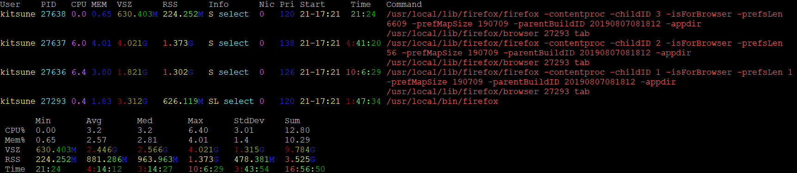

# About
New Colorized PS, a enhanced version of PS with advanced searching capabilities.



The search criteria can be any of the following.

* command
* EUID set
* EGID set
* JID
* is a kernel process
* percent of memory usage
* percent of CPU usage
* RSS
* VSZ
* is swapped out
* process state
* CPU time in seconds
* UID or username
* wait channel
* is a zombie process

# Command Line Options
```
-c <regex>    Search procs using the matching regex.
--ci          Invert the command search.

--cf          Show children minor faults.

--cF          Show children major faults.

--eg          Search for proccs with a EGID set.
--egi         Invert the EGID set search.

--eu          Search for proccs with a EUID set.
--eui         Invert the EUID set search.

-f            Show minor faults.

-F            Show major faults.

-J            Show jail IDs.
-j <jids>     A comma seperated list of JIDs to search for.
--ji          Invert the JIDs earch.

--idle        Show the idle kernel process.

--kern        Searches for kernel processes.
--kerni       Invert the kernel process search.

-m <pctmem>   Memory usage percent to search for.
--mi          Invert the memory usage search.

-n            Show number of threads.

--nc          disable color.

-p <pctcpu>   CPU usage percent to search for.
--pi          Invert the CPU usage search.

--pid <pids>  PIDs to search for.
--pidi        Invert the PID search.

-r <RSSs>     A comma seperated list of RSS values to search for.
--ri          Invert the RSS search.

-s            Show swapped out procs.
--si          Invert the swapped out search.

--self        Show the the ncps process as well.

--st <states> A comma seperated list of states to search for.
--sti         Invert the state search.

--stats       Print some general states about CPU usage and memory usage.

-t <times>    A comma seperated value of time, in seconds, to search for.
--ti          Invert the time search.

--tty         Show TTYs.

-u <UIDs>     A comma seperated list of UIDs or usernames.
--ui          Invert the UID/username search.

-vs <VSZs>    A comma seperated list of VSZs to search for.
--vsi         Invert the VSZ search.

-w <wchans>   A string search for wait channels.
--wi          Invert the wait channel search.

-z            Show zombies procs.


For the various switches above that can take numeric values,
the equalities below can be used, by directly prepending them to
the number.
<
<=
>
>=
!
```

# Installing

## FreeBSD

    pkg install perl5 p5-App-cpanminus
    cpanm Proc::ProcessTable::ncps
    
## Linux

### CentOS

    yum install cpanm
    cpanm Proc::ProcessTable::ncps

### Debian

This has been tested as working on Debian 9 minimal.

    apt install perl perl-base perl-modules make cpanminus gcc 
    cpanm Proc::ProcessTable::ncps
